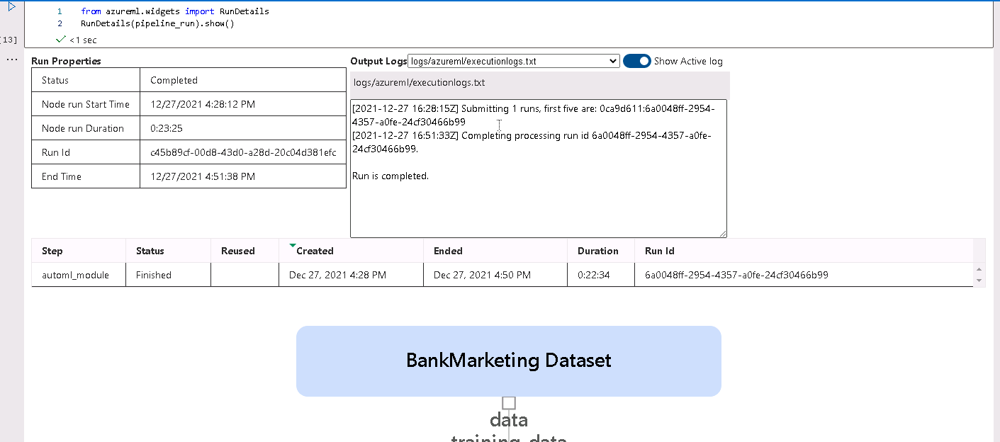
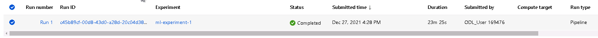
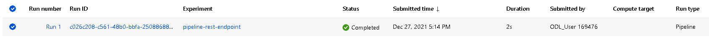
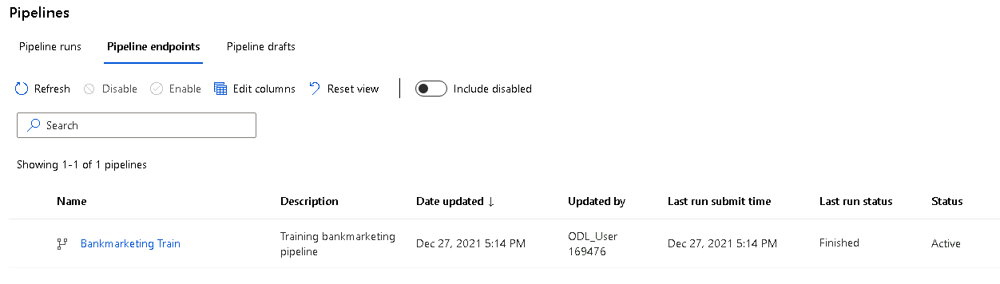

# Operationalizing Machine Learning

## Overview

In this project an AutoML model is created, deployed and consumed via Rest API. 
Then the process is auromated using a pipeline. Finally, the pipeline is published and accessed via Rest API. The steps are:

1) Authentication
2) Automated ML Experiment
3) Deploy the best model
4) Enable logging
5) Swagger Documentation
6) Consume model endpoints
7) Create and publish a pipeline
8) Documentation

## Architectural Diagram

- Authentication is vital to allow third party applications to securely use your published APIs.
- AutoML Model allows to search the best model for you within a time frame. 
- Deploy the best model will allow the model to be available via API using the ACI and enable Auth. 
- Enable Logging will allow you to see any error message during/after the deploy.
- Consume model enpoints will allow the model to make a prediction via Rest API.
- Create and publish a pipeline make the trained model available via rest api and provides a way to interact with the pipeline.
- Documentation: the API methods are documented using swagger. 

## How to improve the project
- We have a very high accuracy but the data is imbalanced so probably we could add a pipeline after loading the dataset that will be in charge to balance the data. 
- We could also try other manual techniques and compare them with AutoML.
- We could retrigger the pipeline everytime we change the dataset. 

# Steps

## Deploy model in Azure ML Studio
### Step 1: Upload Dataset
The first thing we need to do is to download the dataset and then upload it into Azure Datasets. 

### Step 2: Train AutoML
Then we go to the AutoML section and create a new AutoML model that will use the previously uploaded dataset. AutoML will try to search for the best model (that minimizes the error) among a set of models. Once it is completed it will display information about the models and their errors. The best model also is displayed.

### Step 3: Enable Applications insights
Once the model is deployed we can enable application insights via the SDK. This allows to retrieve useful information about metrics of our endpoint, such as failed requests, number of requests, response time of each request, etc. 

### Step 4: Enable Logging
It is also important to enable logging in order to debug and see why our deployment is failing in case it fails. 

### Step 5: Swagger Documentation
In order to see how to consume the deployed endpoint, we should access to the swagger documentation which provides valuable information about the http methods available, how to send/receive information and the path we should use. In this case we have on one hand the GET/ that is used to check the endpoint health, and on the other hand  the POST/score method that allows us to request a prediction given some data. 

### Step 6: Consume API
Then we can make a POST request to our endpoint using python to get a prediction on one or more data rows. 

## Publish an ML Pipeline
### Step 1. Run the pipeline
An AutoML step is created and the pipeline feed with it. Once the pipeline finishes to run it displays information about the time it took, the Run Id, logs information to verify that everything run smoothly, the pipeline steps, etc. This information is provided by the RunDetails widget.

### Step 2: Experiments
In the experiment section we can find information about the pipeline run and its endpoint together with their status and run information.

Also we find information about the individual runs.

### Step 3: Pipeline and its endpoint
Once the pipeline is also published we can verify if it was completed or not in the pipelines section.

If we go to the Pipeline Endpoints tab, we find the pipeline status as active.

### Step 4: Published pipeline overview
We can also see the status and the REST endpoint URL of such pipeline in the details page. 

# Screencast

Link: https://youtu.be/Ggy56Y8pTgY

