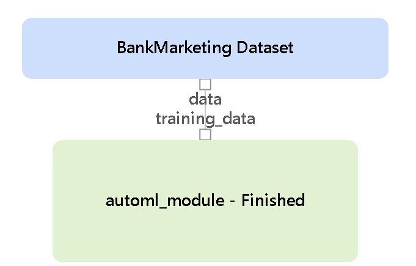

# Operationalizing Machine Learning

## Overview

In this project an AutoML model is created, deployed and consumed via Rest API. 
Then the process is auromated using a pipeline. Finally, the pipeline is published and accessed via Rest API. The steps are:

1) Authentication
2) Automated ML Experiment
3) Deploy the best model
4) Enable logging
5) Swagger Documentation
6) Consume model endpoints
7) Create and publish a pipeline
8) Documentation

## Architectural Diagram

- Authentication is vital to allow third party applications to securely use your published APIs.
- AutoML Model allows to search the best model for you within a time frame. 
- Deploy the best model will allow the model to be available via API using the ACI and enable Auth. 
- Enable Logging will allow you to see any error message during/after the deploy.
- Consume model enpoints will allow the model to make a prediction via Rest API.
- Create and publish a pipeline make the trained model available via rest api and provides a way to interact with the pipeline.
- Documentation: the API methods are documented using swagger. 

## Steps

### Deploy model in Azure ML Studio
1. Dataset uploaded

2. AutoML model completed

3. Enable Applications insights

4. Enable Logging

5. Swagger doc

6. Consume API

## Publish an ML Pipeline

1. Pipeline and its endpoint

2. Published pipeline overview

3. Pipeline steps

4. Experiments including scheduled pipelines

# Screencast

Link: https://youtu.be/Ggy56Y8pTgY

